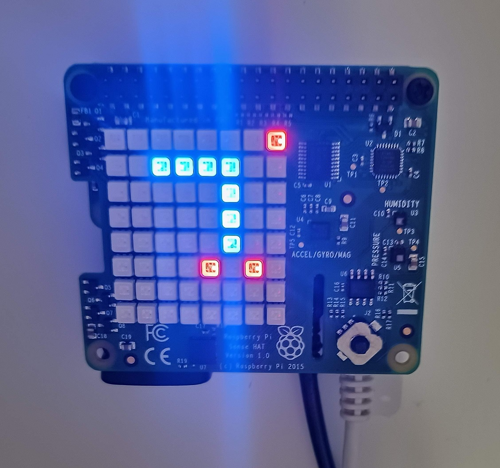

# RapberryPi SenseHAT Snake game

Simple Snake game with RapberryPi SenseHAT (https://astro-pi.org/)
* Based on RPi tutorial: https://projects.raspberrypi.org/en/projects/slug
* Youtube https://youtu.be/mPFS_fbKpeE
* Source code: [sensehat-snake.py](sensehat-snake.py)
* Same code in emulator: https://trinket.io/python/dab636b6f4

You can reset the game by pushing middle button.

## Picture

